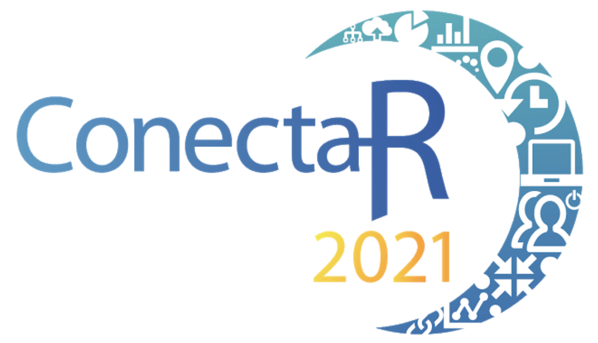

```{r setup, include=FALSE}
options(htmltools.dir.version = FALSE)
library(tidyverse)
library("tm")
library("wordcloud")
library("RColorBrewer")
library("rgdal")
library("cartography")
```


  

Virtual

28 y 29 de enero y 4 y 5 de febrero

---
class: inverse, center, middle

# Detalles del evento

---

# En cifras [personas]

- **142** personas inscritas: 
  - **10** estudiantes de la Escuela de Estadística
  - **3** docentes: **ninguno** de Asamblea de Escuela
  - **23** personas del INEC
- Presentaciones:
  - **12** personas que presentaron carteles (**1** estudiantes de posgrado de Estadística)
  - **16** personas con charlas contribuidas (**3** ex-alumnos de la Escuela)
  - **4** charlistas invitados 
  - **3** comunidades
- Organización:
  - **3** miembros del comité organizador
  - **22** estudiantes UCR voluntarios (**8** estudiantes de grado de Estadística)
  - Apoyo de Alfonso Rojas, Yuliana Soto y Olga Marta Ramírez en la organización.

---

# En cifras [personas]

```{r echo=FALSE, warning=FALSE, include=FALSE}
a<-c("Ecuador", "Peru", "Colombia", "Costa Rica","Chile", "Spain","Mexico", "Canada", "Argentina", "Nicaragua", "Brazil", "United States", "Saudi Arabia")
world_spdf <- readOGR( 
  dsn= paste0(getwd(),"/TM_WORLD_BORDERS_SIMPL-0.3") , 
  layer="TM_WORLD_BORDERS_SIMPL-0.3",
  verbose=FALSE
)
world_spdf$NAME[which(world_spdf$NAME%in%a)]
world_spdf$Asistentes <- as.numeric(world_spdf$NAME%in%a)
```


```{r echo=FALSE, warning=FALSE, out.width='100%', fig.height=5}
choroLayer(spdf = world_spdf, df = world_spdf@data, var = "Asistentes", col=c("#FFFFFF","#135D89"), legend.pos="n")
title("Países con Representantes en ConectaR 2021")
```

---

# En cifras [dinero]

- **2** empresas patrocinadoras $2900 
- **23** inscritos del INEC; **3** de SUGEF.
- **36** pago de inscripción individual
- **6** organizaciones en comité coordinador:
  - Observatorio del Desarrollo - horas asistente, divulgación, contenido, plataforma financiera y tecnológica.
  - ixpantia - apoyo administrativo, atracción de patrocinadores, divulgación, contenido.
  - Escuela de Estadística, Adm Pública, INEC, INNOVAPP: divulgación
- Gastos:
  - Asistentes + apoyo comunicación
  - Premios (camisas, mousepads)
  - Envío de regalías * 
  
  
---

# Descripción de la actividad

- 4 mañanas (de 8am a 1pm)
- 1 keynote y 4 charlas diarias
- Sesiones de preguntas y respuestas de 10 min por presentador
- Charlas rápidas y póster durante el primer día
- Espacio para comunidades en los otros 3 días
- Pausa de 10 mins a media mañana
- Agenda completa: https://conectar2021.github.io/ConectaR2021/agenda/


---
class: inverse, center, middle

# Evaluación del evento

---

# Evaluación por parte de los asistentes

```{r echo=FALSE}
ratings <- 
rbind(  
c("La calidad de los expositores y sus intervenciones",	50,	4.62,	5,	0.57),
c("Temas de investigación reciente",	50,	4.64,	5	,0.53),
c("Cumplimiento de los contenidos del programa",	50,	4.86,	5,	0.40),
c("Cumplimiento en los horarios",	50,	4.88,	5,	0.33),
c("Espacio virtual",	50,	4.72,	5	,0.54),
c("Mezcla de presentaciones pre-grabadas y preguntas en vivo",	50,	4.76,	5,	0.52),
c("Organización de las actividades",	50,	4.88,	5,	0.33),
c("Facilidad de acceso a las actividades",	50,	4.48,	5,	0.68),
c("Instrucciones para entender cómo funciona el evento",	50,	4.56,	5,	0.76),
c("Horario accesible para mi agenda",50,	4.30,	5,	0.97),
c("Proceso de inscripción",	50,	4.24,	5,	0.94),
c("Disponibilidad de la información",	50,	4.52,	5,	0.68),
c("Envío de instrucciones para registro",	50,	4.46,	5,	0.84),
c("Apoyo de la página web del evento",	50,	4.52,	5,	0.79),
c("Apoyo de las personas organizadoras",	50,	4.86,	5,	0.40),
c("Apoyo de las redes sociales",	50,	4.60,	5,	0.73),
c("Uso de Telegram como apoyo a la actividad",	50,	4.68,	5,	0.87),
c("Uso de Zoom como herramienta para la actividad",	50,	4.90,	5,	0.36),
c("Costo de la inscripción",	50,	4.80,	5,	0.45),
c("Calidad de las presentaciones",	50,	4.68,	5	,0.47),
c("Dinámica de la actividad",	50,	4.62,	5,	0.64),
c("Actividades durante el receso",	50,	4.12,	4,	1.02),
c("Premios de las rifas",	50,	4.18,	5,	1.17),
c("Calidad de las presentaciones"	,50,	4.64,	5,	0.60),
c("Espacio para participar en comunidades",	50,	4.76,	5,	0.56),
c("Organización de la actividad",	50,	4.80,	5,	0.40),
c("Evaluación general del evento",	50,	4.71,	5,	0.46))

ratings <- data.frame(ratings)
names(ratings) <- c("Pregunta","n"	,"Media", 	"Mediana"	,"SD")
```


```{r eval=require('DT'), tidy=FALSE, echo=FALSE}
DT::datatable(
  ratings,
  fillContainer = FALSE, options = list(pageLength = 8)
)
```

---

# Comentarios

```{r echo=FALSE, warnings=FALSE, include=FALSE}
comments <- 
list("Estuvo todo excelente, ya quiero que sea el próximo y ojalá poder conocernos personalmente.",
"Hacer talleres de temas específicos.", 
"Excelente iniciativa!", 
"No todos los usuarios tienen twiteer, por lo tanto no pudimos participar por los premios :-(", 
"Noté que generó mucha confusión tener que registrarse cada vez para todas las sesiones, salvó este detalle todo estuvo perfecto, muchas gracias.", 
"Todo muy provechoso", 
"EVENTO DE ALTISIMO NIVEL. TODO UN HONOR PARTICIPAR EN ÉL. SI SE NECESITA APOYO EN ORGANIZACIONES DE FUTUROS EVENTOS, ESTOY MÁS QUE ANUENTE.", 
"Si bien algunos expositores no quieren compartir las presentaciones, lo cual me parece mal para un congreso, al menos deberían compartir un resumen o póster.", 
"Explicar que las inscripciones se pueden hacer todas a la vez.", 
"Excelentes presentaciones, de temas variados y de interés para todos. Me encantó que cumplieran el horario tal cual como se informó",
"Es bueno la interacción con profesionales de múltiples carreras te da una visión del potencial e impacto de r en las industrias y empresas, enfocaría temas más complejos para otros oyentes ver a profundidad un paquete como tidymodels que son recientes y potentes para estar en la vanguardia en temas muy novedosos, pero en general es bonito participar en estos eventos.", 
"Dar más tiempo en los recesos (15-20 minutos) y tal vez respetar el tiempo del almuerzo (o no extenderse más allá de 1:00 pm sin hacer pausas). Al momento de inscribirse al inicio fue un poco confuso, tal vez antes de socializar el procedimiento tenerlo bien definido.",
"Fue un evento excelente, espero participar el próximo año",
"Crear una lista de correos ligadoa a R donde se anuncien actividades ya que al menos mi persona no usa Facebook o Instagram, muchas gracias, excelente el evento",
"Excelentes presentaciones, los feliicto por el evento!!",
"Muchas gracias por el evento. Quizás en lugar de dividir los días por áreas (Academia, Industria, etc) podría por día habilitarse áreas temáticas (Programación, Estadística, Visualización, Tendencias, ML, etc). ",
"Muy bueno",
"Muchas gracias por crear este espacio, se necesita!!",
"Muy bonita la actividad. Para el siguiente ConectaR me gustaría ver algo más detallado sobre anonimización en grandes bases de datos",
"Solamente en la última cesión tuve problemas para ingresar y tuve que pedir el link a un compañero. Por lo de más felicidades y estuvo excelente, estoy motivado para poder conocer más de R e iniciar a trabajar en el.",
"Muy bonita organización, cumple su objetivo el cual es motivar a aprender R y a compartir lo aprendido. Espero poderme irme metiendo en la comunidad para sacarle el máximo provecho.", 
"Síganlo haciendo !", 
"Estuvo muy bien la organización, sin embargo el hecho de extender la actividad dos semanas me pareció un poco cansado, sería más provechoso que todas las actividades se extendieron en una sola semana",
"Si la comunidad crece, debe crecer naturalmente, es decir, por temas o categorías y afinidades de los participantes, dejar que se agrupen naturalmente por aquellos aspectos que les interesan o apasionan. Crecer puede significar hacer grupos más pequeños con el riesgo que se independicen o perderlos. Encontrar algo en común que los mantenga juntos puede ser un reto. Muchos estamos en esto porque nos facilita el trabajo diario y necesitamos aprender. Poco a poco y con recordatorios diarios o semanales de temas simples pero importantes. Muchos nos enfrentamos con problemas de disciplina y procastinación para aprender y avanzar, pues algún contrato o mecanismo de compromiso puede ser de utilidad. O bien, un pequeño costo nos puede dar pereza. Solo unas ideas.", 
"Algunas de las exposiciones pregrabadas tenían problemas de sonido, pero en general la mayoría estuvieron bien.", 
"Muchas felicidades por la organización y ese plus que desinteresadamente ponen cada una de las personas que participan en el evento.", 
"Muy agradecido por toda la experiencia.", 
"Excelente este espacio virtual de encuentro donde conocimos de experiencias de diferentes usuarios de R, independientemente del campo o disciplina en el que se especializan.",
"Muy enriquecedor este congreso para personas con o sin experiencia en esta herramienta.", 
"Muchas gracias!!!")

comments <- Corpus(VectorSource(comments)) 
toSpace <- content_transformer(function (x , pattern ) gsub(pattern, " ", x))
comments <- tm_map(comments, toSpace, "/")
comments <- tm_map(comments, toSpace, "@")
comments <- tm_map(comments, toSpace, "\\|")

#Convert the text to lower case
comments <- tm_map(comments, content_transformer(tolower))
# Remove numbers
comments <- tm_map(comments, removeNumbers)
# Remove english common stopwords
comments <- tm_map(comments, removeWords, stopwords("spanish"))
# Remove your own stop word
# specify your stopwords as a character vector
comments <- tm_map(comments, removeWords, c("cómo", "muchas", "puede")) 
# Remove punctuations
comments <- tm_map(comments, removePunctuation)
# Eliminate extra white spaces
comments <- tm_map(comments, stripWhitespace)
# Text stemming
# docs <- tm_map(docs, stemDocument)

dtm <- TermDocumentMatrix(comments)
m <- as.matrix(dtm)
v <- sort(rowSums(m),decreasing=TRUE)
d <- data.frame(word = names(v),freq=v)
```


```{r echo=FALSE, out.width='100%', fig.height=5, warning=FALSE}
set.seed(1234)
wordcloud(words = d$word, freq = d$freq, min.freq = 1,
          max.words=80, random.order=FALSE, rot.per=0.35, 
          colors=brewer.pal(4, "Dark2"))
```


---

# Limitaciones y Retos

- COVID-19.
- Difícil conseguir patrocinio en épocas de crisis.
- Saturación de eventos virtuales.
- Poca disposición para presentar de parte de la comunidad.
- Lograr que nuestro público trascienda las fronteras de Costa Rica.
- Faltan herramientas de inscripción más eficientes y accesibles para el público nacional e internacional.
- Falta diversificar las listas de contactos.
- Repensar fechas: que no esté tan en medio de vacaciones.
- Traer de vuelta los talleres.
- Anotar los contactos (teléfono) de los presentadores.

---

class: inverse, center, middle

# Impacto

---

# Colaboraciones como resultado del evento

- Materiales del evento: [Repositorio de materiales](https://conectar2021.github.io/Contenido2021/).
- Vistas en redes sociales:
      * Facebook: 20836 alcances, 2307 interacciones con publicaciones, 83 me gusta a la página.
      * Twitter: 5431 vistas de perfil, 68500 impresiones de Tweets, 51 menciones, 843 seguidores. 
      * Instagram: 48 interacciones de contenido, 738 cuentas alcanzadas.
- Canal de YouTube: https://www.youtube.com/channel/UCv1AqLhERRzc2uHsBH7wp3A
- Comunidades (Rladies, DataLatam, CDSB) con aumento de número de miembros.

- Otros que no se han concretado aún.

- Y por supuesto: planes para ConectaR 2023

---
class: inverse, center, middle

# Contactos

<a href="https://www.facebook.com/conectar2021/"><i class="fa fa-link fa-fw"></i>&nbsp; https://www.facebook.com/conectar2021/</a><br>
<a href="https://twitter.com/conecta_R"><i class="fa fa-twitter fa-fw"></i>&nbsp; @conecta_R</a><br>
<a href="https://github.com/ConectaR2021"><i class="fa fa-github fa-fw"></i>&nbsp; @ConectaR2021</a><br>

<a href="mailto:conectar@ucr.ac.cr"><i class="fa fa-paper-plane fa-fw"></i>&nbsp; ConectaR - UCR </a><br>

Esta presentación:

https://malfaro2.github.io/ConectaR2021

---

class: center, middle

# ¡Gracias!


<a rel="license" href="http://creativecommons.org/licenses/by/4.0/"></a><br />Esta presentación tiene una licencia <a rel="license" href="http://creativecommons.org/licenses/by/4.0/">Creative Commons Attribution 4.0 International License</a>.

y fue creada con el paquete de R  [**xaringan**](https://github.com/yihui/xaringan).
